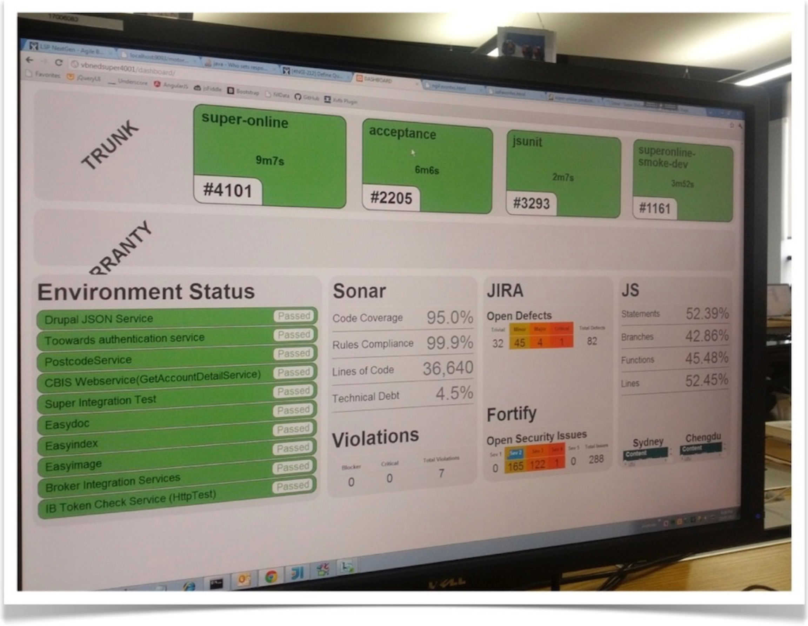

---?image=assets/cd-pipeline.png

# 持续交付流水线

---

## 持续交付

+++

### 目标

**快速**并**安全**地响应业务需求的能力

可靠的软件交付➡️快速推向市场➡️持续的续创新

+++

### 原则

* 快速响应
* 风险前置
* If it hurts，do it more often

+++

### 全景图

+++

**核心**：持续交付自动化流水线

+++

## 流水线

通过自动化工具（脚本）完成由源代码到产品（服务）部署整个过程中的全部操作（包括验证），所有自动操作在独立于开发机的服务器上执行。

+++

### 一般流水线的“阶段”

构建✅👝➡️自动化测试✅📋➡️手动测试👌👆“一键”部署

+++

### 构建阶段

代码提交触发或定时触发

从仓库拉取源代码生成用于部署的候选制品，并上传制品库。

由以下任务组成：编译、单元测试、代码扫描、打包、发布制品

涉及工具：代码管理、脚本、构建工具、依赖管理、单元测试、代码分析等

+++

### 自动化测试阶段

构建成功自动触发或定时触发

从制品库下载候选制品从代码仓库拉取部署脚本，部署到自动化测试环境（ST），执行自动化测试并生成测试报告

由以下任务组成：测试服务器部署、功能自动化测试、非功能自动化测试、Promote候选制品

涉及工具：代码管理、脚本、数据库迁移脚本、功能测试、非功能测试、Provision、云平台、虚拟机、容器等

+++

### 手动测试

“一键”触发

从制品库下载候选制品从代码仓库拉取部署脚本，部署到手动测试环境（UAT），执行探索性测试或者验收测试

由以下任务组成：测试服务器部署、Promote候选制品、打 Label

涉及工具：代码管理、脚本、数据库迁移脚本、Provision、云平台、虚拟机、容器等

+++

### “一键”部署

“一键”触发

从制品库下载候选制品从代码仓库拉取部署脚本，部署到手动测试环境（UAT），执行探索性测试或者验收测试

由以下任务组成：生成服务器部署

涉及工具：代码管理、脚本、数据库迁移脚本、Provision、云平台、虚拟机、容器等

---

## Step By Step

1. 尽可能的自动化，提升效率
2. 用好流水线，并发现瓶颈
3. 优化流水线，适应变化和扩展的需要

---

## 使用工具完成自动化

* 脚本：通用脚本（Shell/Batch）、构建脚本（Maven）、工具脚本（Chef/Ansible）
* 持续集成服务：服务器（RTC/Jenkins）、平台（Travis）
* 云平台：Amazon/GCE/Azure/Aliyun
* 虚拟机和容器：vagrant、docker

+++

---

## 遵守持续集成纪律

+++

### 持续集成看板

+++

### 纪律是灵魂

1. 持续集成如果红了，不允许提交代码
2. 持续集成如果红了，立马修复(如果短时间修复不了，立马回滚)
3. 为自己导致的问题负责
4. 回家之前，一定要保证持续集成 绿

+++

### 关键实践

* 主干开发策略
* 特性开关
* 7 步提交法
* 保持一定的代码覆盖率

---

### 优化流水线使用

* 流水线一次执行时间控制在 20 分钟内，更快的提供反馈
* Fan In & Fan Out，更灵活的流水线编排
* 持续集成服务容器化，更方便的扩展持续集成服务的吞吐量
* 流水线即代码（Pipeline as Code）

